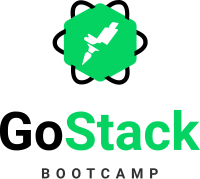
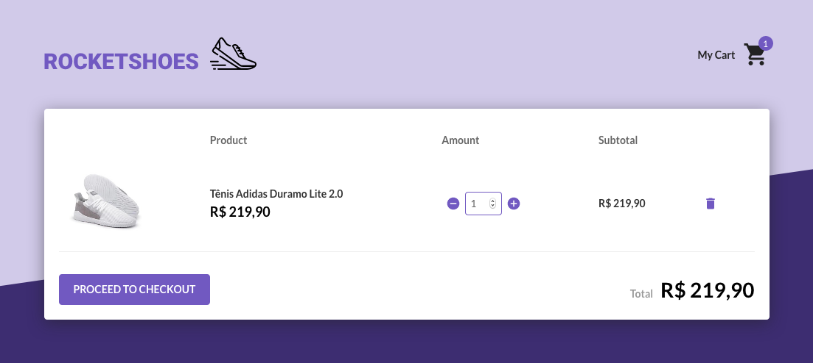
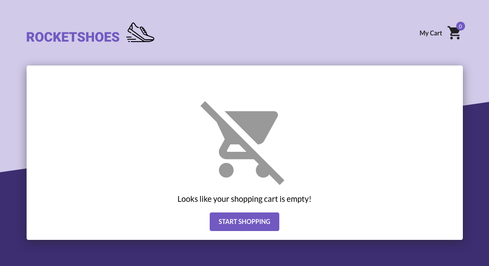

<h1 align="center">
  
</h1>

<h2 align="center">
  
</h2>

<p align="center">
  This project was developed during the <a href="https://rocketseat.com.br/gostack">Rocketseat GoStack Bootcamp</a>.
  <br />
  <br />
  <a href="#technologies">Technologies</a>&nbsp;&nbsp;&nbsp;|&nbsp;&nbsp;&nbsp;
  <a href="#how-to-use">How To Use</a>
</p>

<br />

<p align="center">
  
  <br />
  
  <br />
  
</p>

---

## Technologies

This project was developed with the following technologies:

-  [ReactJS](https://reactjs.org/)
-  [Redux](https://redux.js.org/)
-  [React Router](https://github.com/ReactTraining/react-router)
-  [History](https://www.npmjs.com/package/history)
-  [Redux-Saga](https://redux-saga.js.org/)
-  [Immer](https://github.com/immerjs/immer)
-  [Axios](https://github.com/axios/axios)
-  [Json Server](https://github.com/typicode/json-server)
-  [Styled-Components](https://www.styled-components.com/)
-  [Polished](https://polished.js.org/)
-  [React-Icons](https://react-icons.netlify.com/)
-  [React Toastify](https://fkhadra.github.io/react-toastify/)
-  [React Loader Spinner](https://mhnpd.github.io/react-loader-spinner/)
-  [Reactotron](https://infinite.red/reactotron)
-  [VS Code](https://code.visualstudio.com/) with [EditorConfig](https://marketplace.visualstudio.com/items?itemName=EditorConfig.EditorConfig) and [ESLint](https://marketplace.visualstudio.com/items?itemName=dbaeumer.vscode-eslint)

## How to use

To run this application, you will need [Git](https://git-scm.com/), [Node.js](https://nodejs.org/) and [Yarn](https://yarnpkg.com/) installed on your computer.

From your command line:

```bash
# Clone this repository
$ git clone https://github.com/adeonir/rocketshoes-react

# Go into the directory
$ cd rocketshoes-react

# Install the dependencies
$ yarn

# Run the server
$ yarn server

# Run the app in another command line window
$ yarn start
```

## License

This project is under the MIT license.

---

Made with ♥️ by Adeonir Kohl
